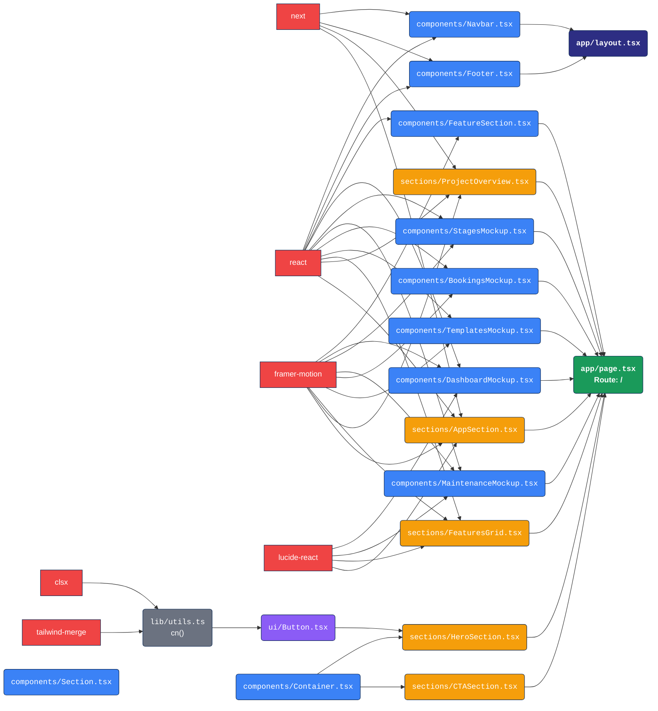

# Aysar App - Dependency Graph



## Architecture Layers

```
┌─────────────────────────────────────┐
│          app/layout.tsx              │  ← Shell (Navbar + Footer)
│  ┌─────────────────────────────────┐│
│  │       app/page.tsx (/)           ││  ← Page (assembles sections)
│  │  ┌─────────────────────────────┐ ││
│  │  │    sections/                │ ││  ← Page-level assemblies
│  │  │  HeroSection, CTASection,   │ ││
│  │  │  FeaturesGrid, ProjectOvr,  │ ││
│  │  │  AppSection                 │ ││
│  │  └──────────┬──────────────────┘ ││
│  │  ┌──────────┴──────────────────┐ ││
│  │  │    components/              │ ││  ← Organisms
│  │  │  Navbar, Footer, Container, │ ││
│  │  │  Section, FeatureSection,   │ ││
│  │  │  5× Mockups                 │ ││
│  │  └──────────┬──────────────────┘ ││
│  │  ┌──────────┴──────┐             ││
│  │  │    ui/Button     │             ││  ← Atoms
│  │  └──────────────────┘             ││
│  └────────────────────────────────────┘│
└─────────────────────────────────────────┘
```

## Import Map

| File | Imports From |
|---|---|
| `lib/utils.ts` | `clsx`, `tailwind-merge` |
| `ui/Button.tsx` | `react`, `@/lib/utils` |
| `HeroSection.tsx` | `@/app/components/Container`, `@/app/components/ui/Button` |
| `CTASection.tsx` | `@/app/components/Container` |
| `FeaturesGrid.tsx` | `react`, `framer-motion`, `lucide-react` |
| `ProjectOverview.tsx` | `react`, `framer-motion`, `next/link` |
| `AppSection.tsx` | `react`, `framer-motion`, `next/image`, `lucide-react` |
| `FeatureSection.tsx` | `react`, `framer-motion` |
| `DashboardMockup.tsx` | `react`, `framer-motion`, `next/image`, `lucide-react` |
| `StagesMockup.tsx` | `react`, `framer-motion` |
| `MaintenanceMockup.tsx` | `react`, `framer-motion`, `lucide-react` |
| `BookingsMockup.tsx` | `react`, `framer-motion` |
| `TemplatesMockup.tsx` | `react`, `framer-motion` |
| `Navbar.tsx` | `react`, `next/link`, `next/image`, `next/navigation` |
| `Footer.tsx` | `next/link`, `next/image` |
| `Container.tsx` | (server component — no imports) |
| `Section.tsx` | (server component — no imports) |
| `page.tsx` | All 5 sections + FeatureSection + 5 mockups |
| `layout.tsx` | `next`, `next/font/google`, `Navbar`, `Footer`, `globals.css` |

## Stats

- **18 source files** (tsx/ts), ~3,500 LOC
- **1 page** (of 6 planned)
- **1 UI atom** (of 6 specified: Input, Badge, Card, Alert, Eyebrow, CheckList missing)
- **10 organism components**
- **5 section assemblies**
- **5 missing pages**: `/plans`, `/contact`, `/privacy-policy`, `/terms-of-use`, `/return-policy`
